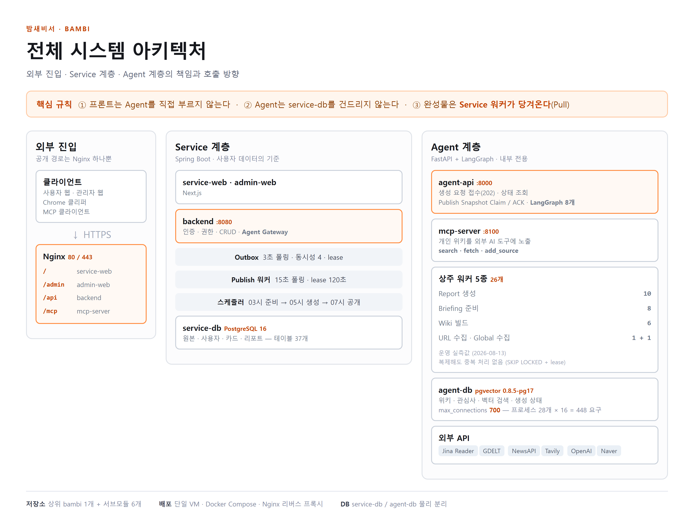

> **📌 이 저장소는 포트폴리오용 포크입니다.**
> 원본: [hk-toss-final-project/bambi](https://github.com/hk-toss-final-project/bambi) · 팀 8명 · 2026.07~08 (4주)
> 아래는 **임소라(flathfk)가 이 프로젝트에서 맡은 부분**이고, 원본 README는 이어서 나옵니다.

# 밤새비서(BamBi) — 내가 한 일

한경 × 토스뱅크 FullStack-LLM 부트캠프 **파이널 프로젝트 · 2등** 🏆

서버가 둘입니다. 사용자가 쓰는 **service**, AI가 도는 **agent**.
저는 **그 사이를 오가는 연동 전부**를 맡았습니다. AI가 무엇을 하는지가 아니라, **그 결과를 어떻게 안전하게 주고받는지**가 제 일이었습니다.

🔗 **배포** — [hktoss.elixirevo.com](https://hktoss.elixirevo.com/) (서비스 웹) · `/admin` (관리자 웹, 계정 필요)

## 전체 시스템 아키텍처



> 데이터 흐름까지 포함한 상세본: [architecture-and-data.pdf](docs/portfolio/architecture-and-data.pdf)

**제 담당 구간은 가운데 `backend`의 Agent Gateway와 오른쪽 Agent 계층 사이의 왕복 전부입니다.**

그림 상단의 핵심 규칙 3개가 곧 제가 지킨 경계입니다.

| 규칙 | 내가 한 일 |
| --- | --- |
| ① 프론트는 Agent를 직접 부르지 않는다 | 모든 agent 호출이 **Agent Gateway 한 곳**을 지나게 배선 — 위키 조회도 중계로 감싸 입력값 clamp·404 처리를 한 곳에서 |
| ② Agent는 service-db를 건드리지 않는다 | 양쪽이 각자 DB를 가지므로 **컨텍스트를 동기화**해야 함 → 버전 정합·409 재전송 ([2-1](https://github.com/flathfk/bambi-service-api#2-1-성공200으로-위장된-실패)) |
| ③ 완성물은 Service 워커가 당겨온다(Pull) | **claim → upsert → ack** 3단계를 설계. Push가 아니라 Pull이라 "호출은 됐는데 저장 전에 죽는" 구간이 없음 |

## 기여 요약

| 레포 | 내 몫 | 규모 |
| --- | --- | --- |
| [bambi-service-api](https://github.com/flathfk/bambi-service-api) | agent 연동 경계 · 아침 브리핑 · 카드 발행 · 관리자 API | 53커밋 / +8,245줄 · PR 14건 · 마이그레이션 4개 |
| [bambi-admin-web](https://github.com/flathfk/bambi-admin-web) | 관리자 화면 전체 | `app/` 1,294 / 1,512줄 (**85%**) |
| [bambi-agent-api](https://github.com/flathfk/bambi-agent-api) | **연동 계약 문서 작성·유지** · taxonomy 매칭 | 15커밋 · PR 3건 |

테스트 클래스 15개 직접 작성.

## 담당 영역

| 영역 | 백엔드로 한 일 |
| --- | --- |
| 사용자 컨텍스트 | 가입 이벤트 → AI 전달. 버전 정합 · 409 재전송 |
| 저장 자료 중계 | 저장 이벤트 → 분기(클리핑 / URL) → 전달 |
| 아침 브리핑 | 주제 결정 **계약** · 폴백 2단 · 타임아웃 분리 |
| 온디맨드 생성 | 즉시 접수 API · 멱등키 · 관심사 검증 정책 |
| 위키 조회 중계 | 화면 요청 → AI 중계 · 입력값 clamp · 404 → 빈 목록 |
| 카드 수령 | claim / 멱등 upsert / ack · 재시도 판단 |
| 생성 상태 | 펜딩 수명주기 · 완성 카드와 연결 |
| 관리자 | 지표 API · 실패 필터 · 복구 버튼 + 화면 3개 |

## 트러블슈팅 — 다섯 건의 공통점

**"정상"이라는 신호가 가장 오래 사람을 속입니다.**

| 사건 | 정상처럼 보이게 만든 신호 | 상세 |
| --- | --- | --- |
| 관심사가 AI에 연결되지 않음 | 응답이 **200** | [service-api](https://github.com/flathfk/bambi-service-api#2-1-성공200으로-위장된-실패) |
| 아침 주제가 엉뚱함 (`서울`, `DBeaver`) | 점수 **1위** | [service-api](https://github.com/flathfk/bambi-service-api#2-2-아침-브리핑-주제-계약을-다시-설계) |
| taxonomy 매칭 0건 | 폴백이 **돌고 있었다** | [agent-api](https://github.com/flathfk/bambi-agent-api#2-3-폴백이-도는데-결과가-0건이던-문제) |
| 카드 형식 값 불일치 | 요청 값을 **그대로 되돌려줬다** | [service-api](https://github.com/flathfk/bambi-service-api#2-4-계약을-코드로-검증해-불일치-2건) |
| 마이그레이션 번호 충돌 | git이 **clean** | [service-api](https://github.com/flathfk/bambi-service-api#2-5-마이그레이션-번호-충돌) |

다섯 건 다 에러 로그로 찾은 게 아니라, **정상이라는 표시를 의심해서** 찾았습니다.

## 시스템 구성 (팀 전체)

내가 맡지 않은 레포는 원본 org를 링크합니다.

| 레포 | 역할 | 담당 |
| --- | --- | --- |
| [bambi-service-api](https://github.com/flathfk/bambi-service-api) | 서비스 API (Spring Boot) | 팀 공동 — **연동/관리자 = 나** |
| [bambi-agent-api](https://github.com/flathfk/bambi-agent-api) | AI Agent (Python) | LLM팀 — **계약 문서 = 나** |
| [bambi-admin-web](https://github.com/flathfk/bambi-admin-web) | 관리자 웹 (Next.js) | **나 (85%)** |
| [bambi-service-web](https://github.com/hk-toss-final-project/bambi-service-web) | 사용자 웹 (Next.js) | 김여진 |
| [bambi-build](https://github.com/hk-toss-final-project/bambi-build) | 배포 · 인프라 | 팀 공동 |
| [bambi-clipper](https://github.com/hk-toss-final-project/bambi-clipper) | 클리핑 확장 | 팀 공동 |

---
---

# Bambi

## 사용법

### 저장소 클론 및 서브모듈 초기화

```bash
# 클론할 때 서브모듈까지 한 번에 받으려면:
git clone --recurse-submodules https://github.com/hk-toss-final-project/bambi.git

# 이미 클론한 뒤 서브모듈을 받아야 하면:
git submodule update --init --recursive
```

### 상위 저장소에 기록된 서브모듈 버전으로 갱신

```bash
# pull 할 때 서브모듈까지 같이 갱신하려면:
git pull --recurse-submodules
git submodule update --init --recursive
```

### 모든 서브모듈의 `main`을 최신화하고 상위 저장소에 반영

먼저 서브모듈 내부에 커밋되지 않은 변경 사항이 없는지 확인합니다.

```bash
git submodule foreach --recursive 'git status --short --branch'
```

모든 서브모듈을 `main` 브랜치로 전환하고 원격의 최신 커밋을 가져옵니다.

```bash
git submodule foreach --recursive \
  'git switch main && git pull --ff-only origin main'
```

변경된 서브모듈 커밋을 확인한 뒤, 상위 저장소의 서브모듈 포인터를 커밋하고
푸시합니다.

```bash
git diff --submodule=log

git add \
  bambi-admin-web \
  bambi-agent-api \
  bambi-build \
  bambi-service-api \
  bambi-service-web

git commit -m "chore: update submodule revisions"
git push origin main
```

`--ff-only`는 로컬과 원격 이력이 갈라진 경우 자동으로 병합 커밋을 만들지 않고
작업을 중단합니다. 위 과정은 서브모듈 내부에 새 커밋을 만드는 것이 아니라, 상위
저장소가 가리키는 서브모듈 커밋 포인터만 갱신합니다.

서브모듈 내부에 직접 만든 커밋까지 함께 푸시해야 한다면, 각 서브모듈의 커밋을
먼저 푸시하거나 다음 명령을 사용할 수 있습니다.

```bash
git push --recurse-submodules=on-demand origin main
```
